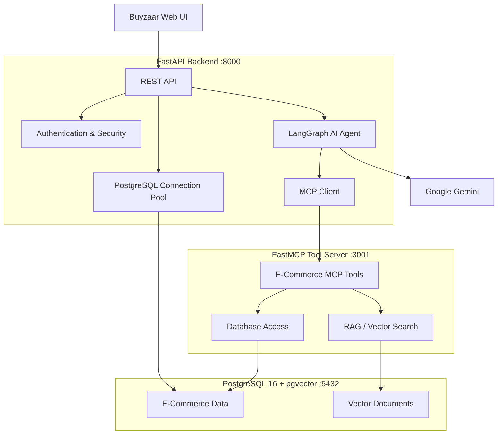
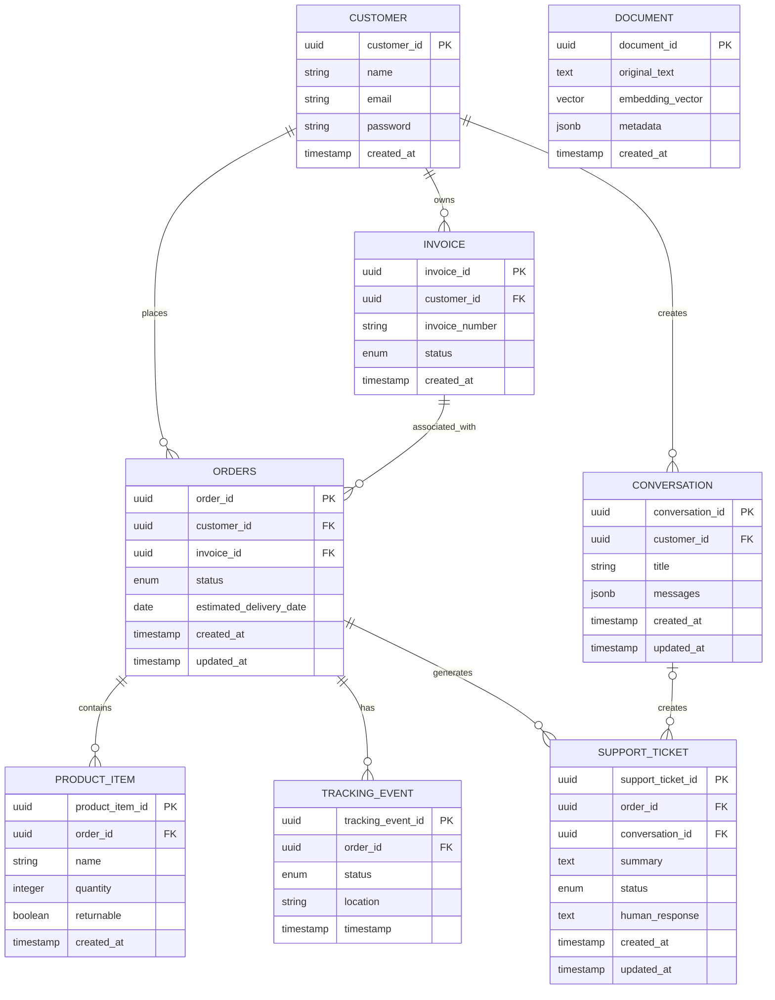

# 🚀 Buyzaar — E-Commerce Backend & AI Support Agent Platform

<p align="center">

  
  
  
  
  
  
  
  
  
  
</p>

<p align="center">

<strong>E-Commerce Backend • AI Customer Support • RAG • MCP • Agent Workflows</strong>

</p>

<div align="center">


</div>

---

## Table of Contents

1. [Project Overview](#1-project-overview)
2. [System Architecture](#2-system-architecture)
3. [Database Architecture](#3-database-architecture)
4. [MCP Tool Server](#4-mcp-tool-server)
5. [MCP Tools Reference](#5-mcp-tools-reference)
6. [REST API Reference](#6-rest-api-reference)
7. [Input Output and Validation](#7-input-output-and-validation)
8. [Environment Configuration](#8-environment-configuration)
9. [Installation and Setup](#9-installation-and-setup)
10. [Running the Services](#10-running-the-services)
11. [API Documentation](#11-api-documentation)
12. [Project Workflow](#12-project-workflow)
13. [Technology Stack Summary](#13-technology-stack-summary)
14. [Buyzaar](#14-buyzaar)

---

# 1. Project Overview

**Buyzaar** is a modern E-Commerce backend platform designed to combine standard business APIs with an intelligent AI customer support system.

The platform provides APIs for:

* Customer management

* Authentication

* Orders

* Order items

* Invoices

* Order tracking

* Customer conversations

* Support tickets

* Knowledge documents

Alongside the REST API, Buyzaar contains a dedicated **FastMCP server** that exposes E-Commerce capabilities as tools for the AI support agent.

The AI support agent uses **LangGraph** to control the workflow and **Google Gemini** for reasoning and response generation. The agent can dynamically discover and execute MCP tools through the MCP client.

For knowledge-based questions, the system uses a **RAG pipeline with PostgreSQL and pgvector** to retrieve relevant policies, FAQs, and other stored knowledge.

### Main Components

* **FastAPI** — Provides the main REST API and application backend.

* **PostgreSQL** — Stores E-Commerce and customer data.

* **Docker Compose** — Runs PostgreSQL and related infrastructure consistently.

* **pgvector** — Provides vector storage and similarity search for RAG.

* **LangGraph** — Controls the AI agent workflow.

* **Google Gemini** — Provides LLM reasoning and response generation.

* **LangChain** — Provides LLM and MCP integration.

* **FastMCP** — Provides the MCP tool server.

* **LangChain MCP Adapters** — Connects the LangGraph agent to MCP tools.

* **Pydantic** — Validates structured API and tool data.

* **JWT** — Provides authentication tokens.

* **Argon2** — Securely hashes customer passwords.

* **Uvicorn** — Runs the FastAPI application.

* **Web UI** — Provides the customer-facing E-Commerce interface and AI support chatbot.

---

# 2. System Architecture

The platform consists of several cooperating components.



---

# 3. Database Architecture

Buyzaar uses **PostgreSQL 16** as its primary relational database.

The database also uses **pgvector** for storing and searching document embeddings.

## Main Database Entities

| Entity               | Purpose                                           |
| -------------------- | ------------------------------------------------- |
| Customer             | Stores customer account information               |
| Invoice              | Stores customer invoice information               |
| Order                | Stores customer order information                 |
| Order Item           | Stores products contained in orders               |
| Tracking Event       | Stores order delivery lifecycle events            |
| Conversation         | Stores customer support conversations             |
| Conversation Message | Stores individual customer and AI messages        |
| Support Ticket       | Stores escalated customer support issues          |
| Document             | Stores knowledge-base documents                   |
| Document Chunk       | Stores processed document sections and embeddings |

## Database Relationship

## Database Relationship



---

# 4. MCP Tool Server

Buyzaar uses **FastMCP** to expose E-Commerce operations as AI-accessible tools.

The MCP server runs independently from the FastAPI application.

## Why MCP?

MCP provides a standardized interface between the AI agent and external capabilities.

This separates:

```text
AI Reasoning

     ↓

MCP Client

     ↓

MCP Tools

     ↓

Business Operations

     ↓

Database
```

This architecture keeps AI reasoning separate from database and business operations.

## MCP Communication

The FastAPI application acts as the MCP client.

The MCP client connects to the FastMCP server using HTTP.

The FastMCP server exposes the available E-Commerce tools.

The tools communicate with PostgreSQL and pgvector.

---

# 5. MCP Tools Reference

All MCP tools use structured input and output models.

Validation is performed using **Pydantic**.

The README intentionally provides a high-level tool reference rather than complete request and response schemas.

## MCP Tool List

| Tool Name             | Endpoint / Tool            | Description                                                                 |
| --------------------- | -------------------------- | --------------------------------------------------------------------------- |
| Get Order             | `get_order`                | Retrieves information about a specific customer order.                      |
| List Order Items      | `list_order_items`         | Retrieves products and quantities associated with an order.                 |
| Track Order           | `track_order`              | Retrieves the tracking history and current delivery status of an order.     |
| Cancel Order          | `cancel_order`             | Attempts to cancel an order after checking whether cancellation is allowed. |
| Search Query          | `search_query`             | Performs semantic search against knowledge-base documents using pgvector.   |
| Create Support Ticket | `create_support_ticket`    | Creates a support ticket for a customer issue.                              |
| Get Support Ticket    | `get_support_ticket_by_id` | Retrieves a support ticket using its identifier.                            |
| Update Support Ticket | `update_support_ticket`    | Updates the status or human-support response of a support ticket.           |
| List Tickets by Order | `list_tickets_by_order_id` | Retrieves support tickets associated with an order.                         |

---

# 6. REST API Reference

The FastAPI application exposes REST APIs for E-Commerce and AI operations.

All structured request and response data is validated or represented using Pydantic models where applicable.

## Authentication APIs

| Method | Endpoint         | Description                                                 |
| ------ | ---------------- | ----------------------------------------------------------- |
| `POST` | `/auth/register` | Registers a new customer account.                           |
| `POST` | `/auth/login`    | Authenticates a customer and returns authentication tokens. |
| `POST` | `/auth/refresh`  | Generates a new access token using a refresh token.         |

## Customer APIs

| Method   | Endpoint                                | Description                                                                         |
| -------- | --------------------------------------- | ----------------------------------------------------------------------------------- |
| `GET`    | `/customer/{customer_id}`               | Retrieves customer information.                                                     |
| `PUT`    | `/customer/{customer_id}`               | Updates supported customer information.                                             |
| `DELETE` | `/customer/{customer_id}`               | Deletes a customer account and associated data according to database relationships. |
| `GET`    | `/customer/{customer_id}/conversations` | Retrieves the customer's conversation history.                                      |

## Order APIs

| Method   | Endpoint                   | Description                               |
| -------- | -------------------------- | ----------------------------------------- |
| `POST`   | `/orders/`                 | Creates a new order.                      |
| `GET`    | `/orders/{order_id}`       | Retrieves order information.              |
| `GET`    | `/orders/{order_id}/items` | Retrieves items associated with an order. |
| `PUT`    | `/orders/{order_id}`       | Updates an order.                         |
| `DELETE` | `/orders/{order_id}`       | Deletes an order.                         |

## Invoice APIs

| Method | Endpoint                           | Description                                  |
| ------ | ---------------------------------- | -------------------------------------------- |
| `POST` | `/invoices/`                       | Creates an invoice.                          |
| `GET`  | `/invoices/customer/{customer_id}` | Retrieves invoices belonging to a customer.  |
| `GET`  | `/invoices/{invoice_id}`           | Retrieves an invoice by identifier.          |
| `GET`  | `/invoices/{invoice_id}/orders`    | Retrieves orders associated with an invoice. |
| `PUT`  | `/invoices/{invoice_id}/status`    | Updates an invoice status.                   |

## Order Tracking APIs

| Method | Endpoint                      | Description                                 |
| ------ | ----------------------------- | ------------------------------------------- |
| `POST` | `/orders/{order_id}/tracking` | Creates a tracking event for an order.      |
| `GET`  | `/orders/{order_id}/tracking` | Retrieves the tracking history of an order. |

## AI Agent APIs

| Method | Endpoint      | Description                                       |
| ------ | ------------- | ------------------------------------------------- |
| `POST` | `/agent_call` | Sends a customer message to the AI support agent. |

## Document APIs

| Method | Endpoint            | Description                                               |
| ------ | ------------------- | --------------------------------------------------------- |
| `POST` | `/documents/upload` | Uploads knowledge content for processing and RAG storage. |

---

# 7. Input Output and Validation

The platform uses **Pydantic** for structured data validation.

The README intentionally does not contain complete JSON request and response schemas for individual APIs and MCP tools.

---

# 8. Environment Configuration

Buyzaar uses environment variables for configuration.

Sensitive values should never be hard-coded into source code.

## Database Configuration

The application requires configuration for:

* PostgreSQL host

* PostgreSQL port

* Database name

* Database username

* Database password

* Minimum connection pool size

* Maximum connection pool size

## Google Gemini Configuration

AI functionality requires:

* Google API key

* LLM model name

* LLM temperature

## Authentication Configuration

JWT configuration includes:

* Secret key

* JWT algorithm

* Access-token expiration

* Refresh-token expiration

## MCP Configuration

MCP configuration includes:

* MCP server host

* MCP server port

* MCP server URL

Environment configuration should be provided according to the deployment environment.

---

# 9. Installation and Setup

## Prerequisites

Install the following before starting the project:

* Git

* Python 3.10+

* Docker

* Docker Compose

* Google Gemini API access

---

## Step 1 — Fetch the Repository

Clone the project repository:

```bash
git clone <repository-url>
```

Move into the project directory:

```bash
cd <project-directory>
```

---

## Step 2 — Set Up the Python Environment

Create and activate a Python virtual environment according to your local development setup.

Install the required dependencies:

```bash
pip install -r requirements.txt
```

Configure the required environment variables before starting the application.

---

## Step 3 — Start PostgreSQL with Docker Compose

Start the infrastructure:

```bash
docker compose up -d
```

Check the running containers:

```bash
docker ps
```

The PostgreSQL container should be running before starting the application services.

---

## Step 4 — Start the MCP Server

Start the FastMCP tool server:

```bash
python -m server.server
```

The MCP server typically runs on:

```text
http://localhost:3001
```

The actual host and port depend on the configured environment.

---

## Step 5 — Start the FastAPI Server

Open another terminal and start FastAPI using Uvicorn:

```bash
uvicorn app.main:app --host 0.0.0.0 --port 8000 --reload
```

The API will typically be available at:

```text
http://localhost:8000
```

---

## Recommended Startup Order

```text
1. Clone Repository

        ↓

2. Set Up Python Environment

        ↓

3. Install Dependencies

        ↓

4. Configure Environment Variables

        ↓

5. docker compose up -d

        ↓

6. Start FastMCP Server

        ↓

7. Start FastAPI Server

        ↓

8. Start Buyzaar Web UI
```

---

# 10. Running the Services

Buyzaar requires the PostgreSQL infrastructure, MCP server, and FastAPI server to be available.

## Terminal 1 — PostgreSQL

```bash
docker compose up -d
```

## Terminal 2 — MCP Server

```bash
python -m server.server
```

## Terminal 3 — FastAPI Server

```bash
uvicorn app.main:app --host 0.0.0.0 --port 8000 --reload
```

## Service Overview

| Service    | Default Port | Purpose                   |
| ---------- | -----------: | ------------------------- |
| PostgreSQL |       `5432` | Main database             |
| FastMCP    |       `3001` | AI tool server            |
| FastAPI    |       `8000` | REST API and AI agent API |
| Web UI     |       `5173` | Customer-facing frontend  |

The exact ports can be changed through environment configuration.

---

# 11. API Documentation

FastAPI automatically generates interactive API documentation.

After starting the FastAPI application:

### Swagger UI

```text
http://localhost:8000/docs
```

### ReDoc

```text
http://localhost:8000/redoc
```

Swagger UI can be used to:

* View available APIs

* Inspect endpoint descriptions

* Review Pydantic validation

* Test endpoints

* Review request parameters

* Review API responses

---

# 12. Project Workflow

## AI Customer Support Workflow

```text
Customer

   ↓

Buyzaar Chatbot

   ↓

POST /agent_call

   ↓

LangGraph

   ↓

Google Gemini

   ↓

Tool Decision

   ↓

MCP Client

   ↓

FastMCP Server

   ↓

MCP Tool

   ↓

PostgreSQL / pgvector

   ↓

Tool Result

   ↓

LangGraph

   ↓

Google Gemini

   ↓

Customer Response
```

## RAG Workflow

```text
Customer Question

       ↓

AI Agent

       ↓

Search Query Tool

       ↓

Embedding Generation

       ↓

pgvector Similarity Search

       ↓

Relevant Document Chunks

       ↓

Gemini

       ↓

Context-Aware Response
```

---

# 13. Technology Stack Summary

| Technology                 | Purpose                                    |
| -------------------------- | ------------------------------------------ |
| **Python**                 | Primary backend programming language       |
| **FastAPI**                | REST API and backend application framework |
| **Uvicorn**                | ASGI server for running FastAPI            |
| **PostgreSQL 16**          | Primary relational database                |
| **pgvector**               | Vector similarity search for RAG           |
| **Psycopg2**               | PostgreSQL database connectivity           |
| **Docker**                 | Containerized infrastructure               |
| **Docker Compose**         | Local infrastructure orchestration         |
| **LangGraph**              | AI agent workflow orchestration            |
| **LangChain**              | LLM and MCP integration                    |
| **Google Gemini**          | LLM reasoning and response generation      |
| **FastMCP**                | MCP tool server                            |
| **LangChain MCP Adapters** | MCP client integration                     |
| **Pydantic**               | Input and output validation                |
| **JWT**                    | Authentication                             |
| **Argon2**                 | Password hashing                           |
| **Jinja2**                 | Prompt templating                          |

---

# 14. Buyzaar

**Buy. Explore. Get Support.**

Buyzaar combines traditional E-Commerce backend services with an intelligent AI customer support experience powered by **FastAPI, PostgreSQL, LangGraph, LangChain, FastMCP, Google Gemini, and pgvector**.

> 🚧 **Buyzaar is currently a Work in Progress.**
