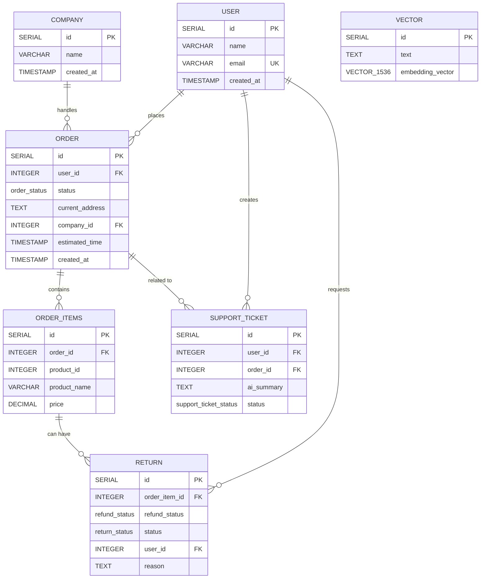

---
# E-Commerce AI Support Agent
## Database Schema

---

## ER Diagram

---

# AI Customer Support & Operations Agent - Test Questions

## Order Status & Tracking (1-10)
1. Where is my order #12345?
2. Can you track my order OD-98765?
3. My order hasn't arrived yet. Can you check?
4. What's the status of my recent order?
5. When will order #54321 be delivered?
6. Has my order been shipped?
7. Why is my order taking so long?
8. Can you find my order using my email address?   **
9. I placed an order yesterday, where is it?  **
10. Track my order and tell me the expected delivery date  **

## Product Issues & Defects (11-20)
11. I received the wrong product.
12. The product I received is damaged.
13. The item doesn't match the description on the website. 
14. My product arrived broken. What do I do?
15. I got a defective item. Can you help?
16. The color of the product is different from what I ordered.
17. The size is wrong. I ordered medium but got large.
18. The product doesn't work as advertised.
19. I received a completely different item than what I ordered.
20. The packaging was damaged and the product inside is ruined.

## Returns & Refunds (21-30)
21. Can I return this product?
22. What is your refund policy?
23. How long do I have to return an item?
24. Can I get a refund instead of a replacement?
25. When will I receive my refund?
26. The return process is confusing. Can you help?
27. Can I return an opened item?
28. What's the refund timeline?
29. Do you accept returns after 30 days?
30. Can I return items purchased on sale?

## Order Cancellation (31-35)
31. Cancel my order #12345.
32. I want to cancel my recent order. Can you do that?
33. Can I cancel an order that's already shipped?
34. How do I cancel my order?
35. I need to cancel order OD-55555 immediately.

## Emotional/Complaint Scenarios (36-40)
36. I'm really unhappy. I want a refund.
37. This is the worst purchase ever. I'm very disappointed.
38. Your service is terrible! I demand to speak to a manager.
39. I've been waiting 2 weeks for my order. This is unacceptable.
40. I'm extremely frustrated with your company and want compensation.

## Policy & General Questions (41-45)
41. What is your shipping policy?
42. Do you offer free shipping?
43. How much does expedited shipping cost?
44. What payment methods do you accept?
45. Do you have a warranty on your products?

## Complex/Escalation Scenarios (46-50)
46. My order is lost. I've waited 4 weeks. I need immediate assistance.
47. I want a refund AND a replacement because the item is defective.
48. The product broke after one week. Is this covered by warranty?
49. I'm moving and need to change my delivery address urgently.
50. I've submitted 3 return requests but never heard back. What's happening?

---

# AI Customer Support & Operations Agent - Test Questions (Part 2)

## Account & Profile Issues (1-10)
1. How do I reset my password?
2. I can't log into my account.
3. Can you help me update my profile information?
4. How do I change my email address?
5. I forgot my username. Can you help? **
6. Is my account secure?
7. How do I delete my account?
8. Can I merge two accounts?
9. I'm locked out of my account after too many login attempts.
10. How do I enable two-factor authentication?

## Shipping & Delivery (11-20)
11. What are the shipping options available?
12. How long does standard shipping take?
13. Can I change my shipping address after ordering?
14. Do you ship internationally?
15. My package was marked as delivered but I didn't receive it.
16. Can I request a specific delivery date?
17. What happens if I'm not home for delivery?
18. Do you offer same-day delivery?
19. Why is my shipping cost so high?
20. Can you reroute my package to a different address?

## Payment & Billing (21-30)
21. Why was I charged twice for one order?
22. Can I update my payment method?
23. Do you offer payment plans or installments?
24. What's this charge on my credit card?
25. Can I use a gift card for this purchase?
26. Do you accept PayPal?
27. Is my payment information secure?
28. Can I get an invoice for my order?  **
29. Why was my payment declined?
30. Do you offer discounts or promotional codes? 

## Product Information & Availability (31-40)
31. Is this item in stock?  **
32. When will this product be back in stock?  **
33. What are the exact dimensions of this item?  **
34. Is this product compatible with [specific item]?  **
35. What materials is this product made from?  **
36. Do you have this item in a different color?  **
37. Can you recommend a similar product?  **
38. How much does this product weigh?  **
39. What's the difference between these two products? **
40. Is this product environmentally friendly?  **

## Discount & Promotion Issues (41-45)
41. Why didn't my coupon code work?  
42. How do I apply a promotional code?
43. Are there any current sales or discounts?
44. Do you have a loyalty program?
45. Can I stack multiple discount codes?

## Escalation & Urgent Cases (46-50)
46. I need to speak to a human representative immediately.
47. This is a critical issue. Can you escalate this?
48. I'm very upset and need management involvement.
49. Can you call me back about my order issue?
50. This situation requires urgent escalation. Who can help me?